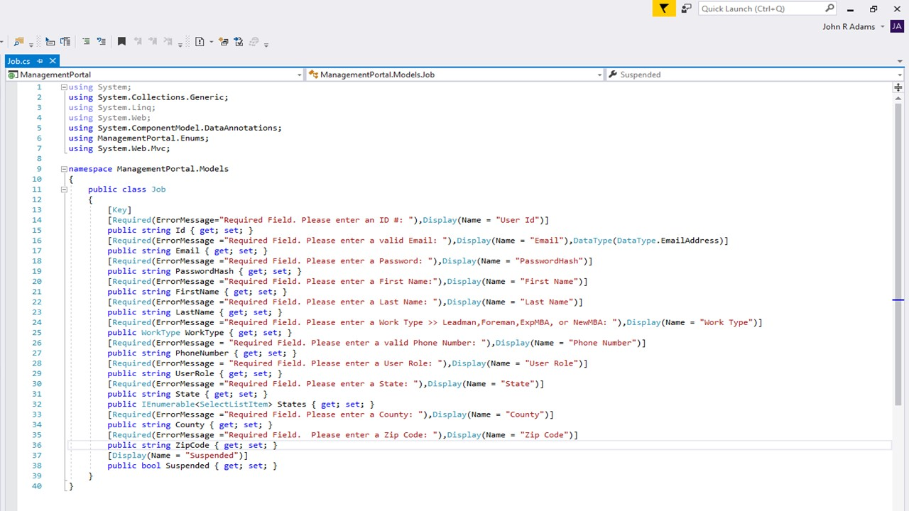
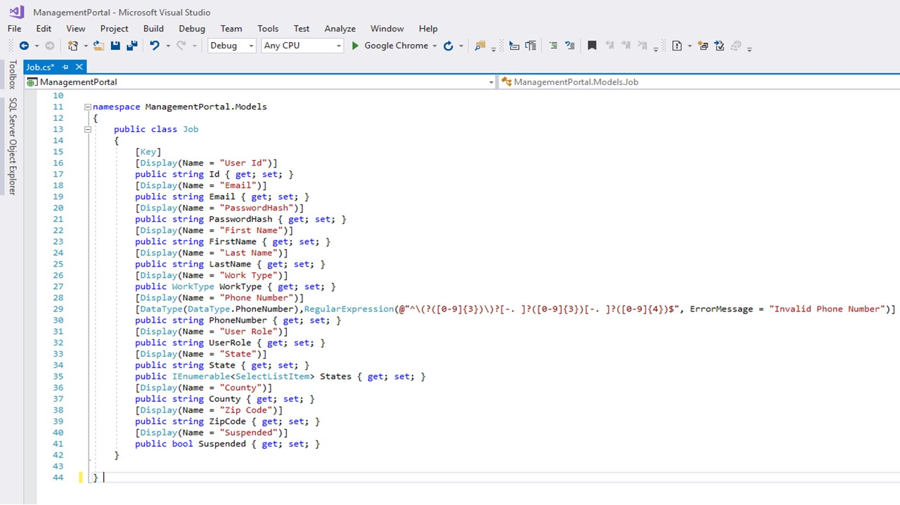

<h1>C# .NET Live Project</h1>

<h2>Table of Contents</h2>
<ul>
  <li>Introduction</li>
  <li></li>
  <li></li>
  <li></li>
  <li></li>
</ul>
<h2 id="Introduction">Introduction</h2>

<h5>
For the last two weeks of my time  at the Tech Academy, I worked with my peers in a team developing a full scale MVC/MVVM Web Application in C#.  
 
 
Working on a legacy codebase was a great learning opportunity for fixing bugs, cleaning up code, and adding requested features. 
There were some big changes and challenges in the project that could have caused project delays.  
However, our team utilized our team’s strengths and banded together to complete the project in a timely manner.  
This live project demonstrated to me how a proactive and effective software developer works and what a software developer has to do 
to make a quality product. I worked on several back-end stories that I am very proud of.  
Over the two-week sprint I also had the opportunity to work on some other project management and team programming skills 
that  I am confident I will use again and again on future projects.  
 
 
Below are descriptions of the stories I worked on, along with code snippets and navigation links. 
I also have some full code files in this repo for the larger functionalities I implemented.
</h5>

<h2 id="BE-Task-1>Back-End Task: Adding Job Seed Data to the Project</h2>

<h5>
A major task for this live project was creating a way to seed test data to the database.  
This was a challenging back-end task because to ensure that the data would take over multiple migrations of the database, 
the seed data had to be integrated into the startup procedure when the web application first runs instead of in the Migrations Folder 
in the configuration file as is typically done with a MVC web application. 
Below is a snippet of the code that I created to solve this problem, and provide way to seed the database to ensure database migration integrity. 
</h5>
<h3>Method used in Startup.cs file to seed data to database:</h3>
<code>
  private void addDataToTables()
        {
            ApplicationDbContext context = new ApplicationDbContext();

            var jobs = new List<Job>
            {
                   new Job
                     {
                        Id = "101",
                        Email = "john.irons@companyname.com",
                        PasswordHash = "**********",
                        FirstName = "John",
                        LastName = "Irons",
                        WorkType = WorkType.Leadman,
                        PhoneNumber = "703-212-6573",
                        UserRole = "Wielder",
                        Suspended = false,
                        State = "Arizona",
                        County = "Yuma",
                        ZipCode = "58392",
                     },
                   new Job
                       {
                         Id = "201",
                         Email = "roberto.tran@companyname.com",
                         PasswordHash = "**********",
                         FirstName = "Roberto",
                         LastName = "Tran",
                         WorkType = WorkType.Foreman,
                         PhoneNumber = "424-369-1256",
                         UserRole = "Construction Manager",
                         Suspended = false,
                         State = "Florida",
                         County = "Orange",
                         ZipCode = "32819"
                        },
                  new Job
                        {
                            Id = "301",
                            Email = "bruce.wayne@companyname.com",
                            PasswordHash = "**********",
                            FirstName = "Bruce",
                            LastName = "Wayne",
                            WorkType = WorkType.ExpMBA,
                            PhoneNumber = "212-720-2071",
                            UserRole = "Senior Executive",
                            Suspended = false,
                            State = "New York",
                            County = "Gotham",
                            ZipCode = "53540"
                        }, 
                  new Job
                        {
                           Id = "401",
                            Email = "diania.prince@companyname.com",
                            PasswordHash = "**********",
                            FirstName = "Diana",
                            LastName = "Prince",
                            WorkType = WorkType.NewMBA,
                            PhoneNumber = "351-639-5488",
                            UserRole = "Corporate Lawyer",
                            Suspended = false,
                            State = "California",
                            County = "Cisco",
                            ZipCode = "53540"
                        }, 
                  new Job
                        {
                           Id = "501",
                            Email = "richard.parker@companyname.com",
                            PasswordHash = "**********",
                            FirstName = "Richard",
                            LastName = "Parker",
                            WorkType = WorkType.Foreman,
                            PhoneNumber = "963-675-1259",
                            UserRole = "Land Surveyour",
                            Suspended = false,
                            State = "Oregon",
                            County = "Klamath",
                            ZipCode = "97601"
                        }
            };
            jobs.ForEach(s => context.Jobs.AddOrUpdate(p => p.LastName, s));
            try
            {
                context.SaveChanges();
            }
            catch (System.Data.Entity.Validation.DbEntityValidationException ex)
            {
                var errorMessages = ex.EntityValidationErrors.SelectMany(x => x.ValidationErrors).Select(x => x.ErrorMessage);
                //Join the list to a single string. 
                var fullErrorMessage = string.Join("; ", errorMessages);
                throw new Exception(fullErrorMessage);
            }
        }
</code>
<h4>Snapshot of seed data in MVC Web Application</h4>

<h2 id="BE-Task-2">Back-End Task: Validating User Input When Creating Jobs</h2>

<h5>
An important aspect for processing user input when uploading to a database is validating that the data entered is correct.  
If user input is not validated, then incorrect data can be added to the database.  To insure job information for employees are entered correctly, I coded into the Job Model parameters that would validate the properties of the model.  
Below is a code snippet of the validated model:
</h5>

<h4>Snapshot of User Input Validation</h4>

 

<h2 id="BE-Task-3">Back-End Task: Phone Number Validation</h2>

<h5>
The final task on the project revolved around finding a way to validate that a proper number is entered while a user is creating a new job on the Create Job page. This task proved to be a challenge.  However, I was able to find a method to validate a phone number when entered into the web form.  Below is code that validates the number:
</h5>

 
<h4>Snapshot of Phone Number Validation in Web Application</h4>

 

 

<h2>Other Skills Gained From C#.NET Live Project Experience</h2>

<ul>
  <li>
    Experience working in an Azure DevOps Enviroment.
  </li>
  <li>
    Discovered new methods in seeding test data through Startup.cs file to improve database integrity.
  </li>
  <li>
    Supporting team members by aiding team members in completing tasks.
  </li>
  <li>
    Most of all, this C# .NET Live Project provided me an insight working on a large-scale team to complete a MVC application for a client.
  </li>
</ul>

